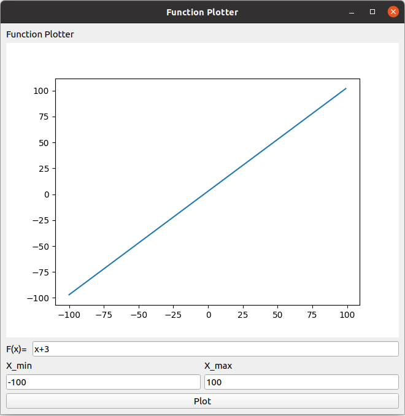
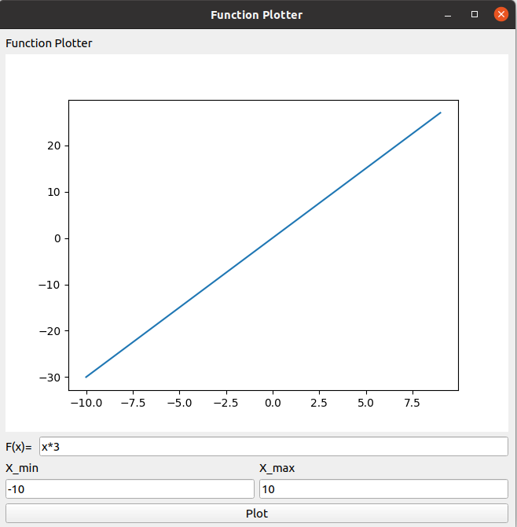
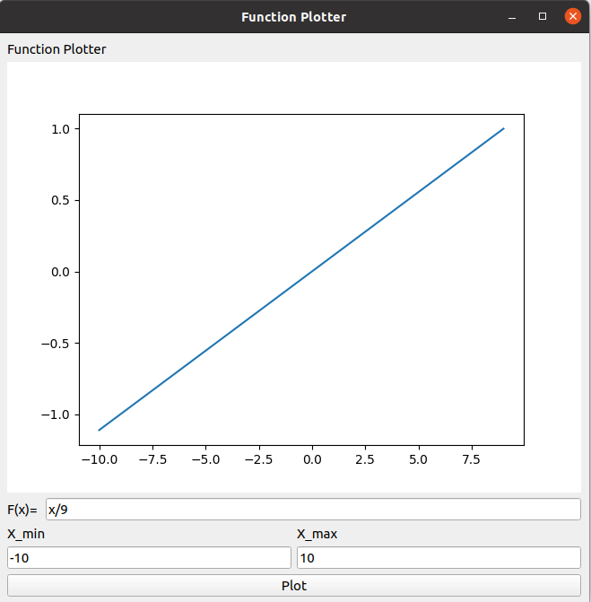
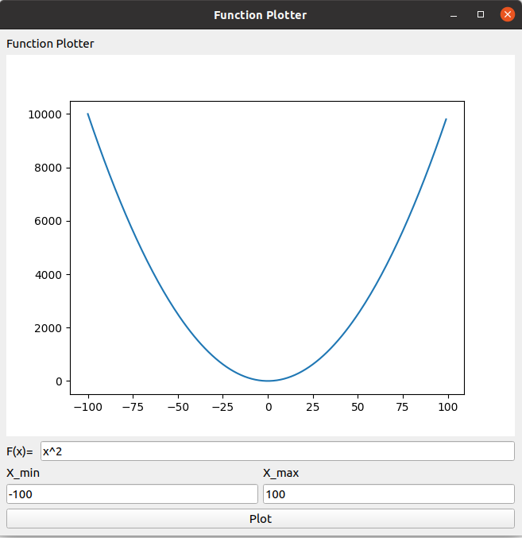
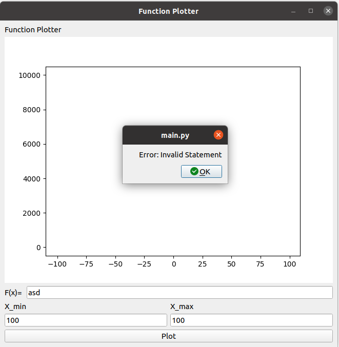
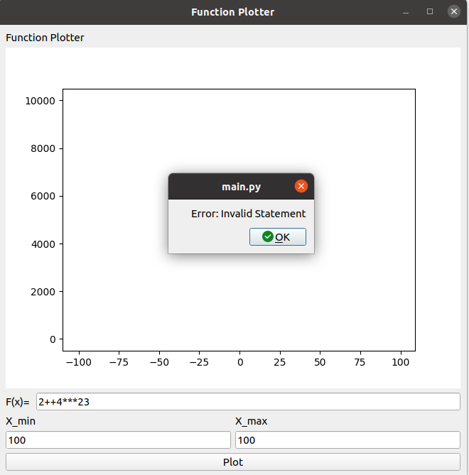
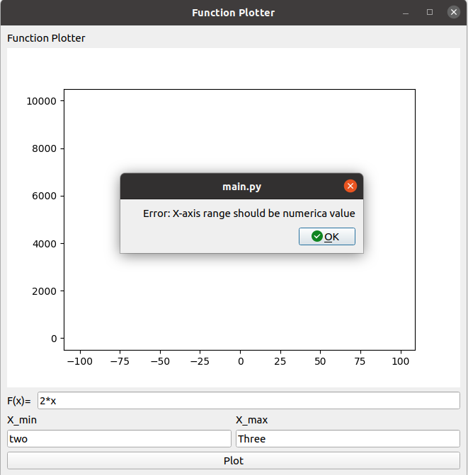
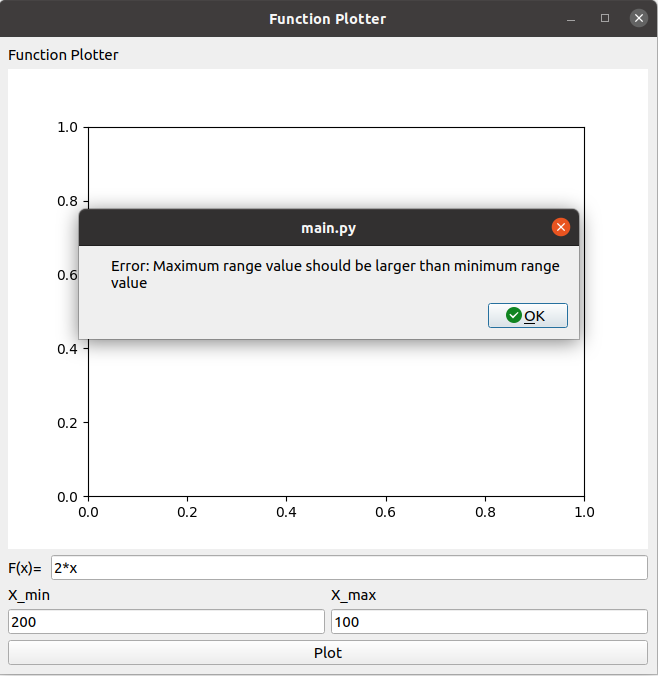
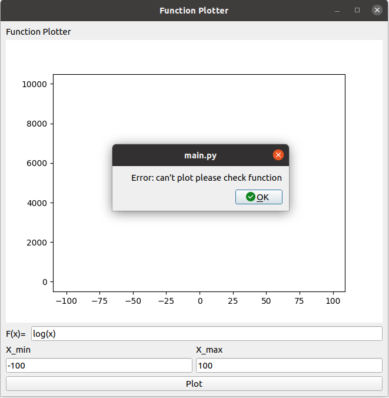
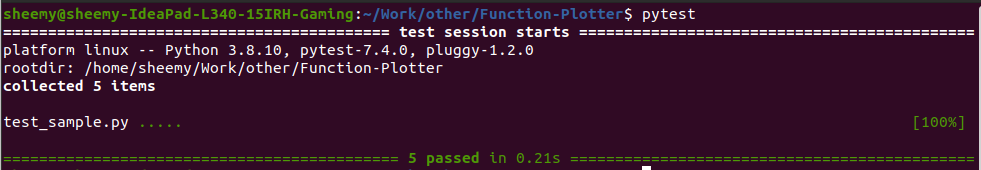

# Function-Plotter
Function Plotter GUI application 

## Description
The Function Plotter GUI application allows users to plot mathematical equations, the application supports addition, subtraction, multiplicaiton, division, power and other mathematical and trignometric functions.
I have implemented the function plotter app using **python** programming language, **pyside2** for GUI, **matplot** for plotting, **sympy** for calculations and **pytest** as a testing framework.

## Installation
1. Make sure you have at least python version 3.6.x
1. Make sure you have installed the right libraries
2. ```!pip install PySide2 sympy pytest```

## Usage
1. Clone the repo
2. Make sure you have installed the dependencies
3. Run ```python3 main.py```
4. Enter Min and Max value of x-axis range, enter the mathematical input statement and hit plot

for testing:

5. Run ```pytest```
6. To run test scripts on the calculation function

## File Structure
1. main.py: Contains the main program functionality which is the GUI initialization, Input and output handling and integrating the GUI with backend functions
2. calculate.py: Executes the mathematical input statement and return the result to be plot
3. test_sample.py: Test script that contains test functions for the execution function in calculate.py

## Test Runs 


Snapshots from Program:

Valid input from user examples:

Addition:



Multiplication:



Division:



Power:




Invalid input from user examples:

Invalid input statement (Wrong variables): 



Invalid input statement (Wrong operations): 



Invalid range (non-numerical values): 



Invalid range (max smaller than min values): 



Invalid logical result (for ex: log(-ve)): 



Test script run:


